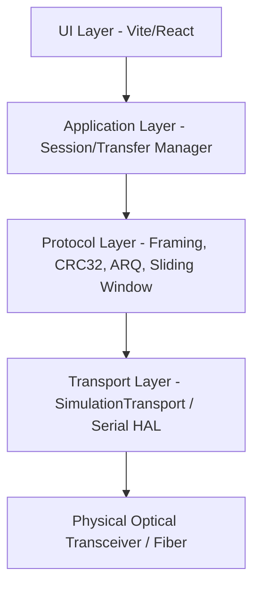

# Architecture Documentation - Optical Fiber File Transfer System

## Overview
The Optical Fiber File Transfer System is designed for offline, high-speed, point-to-point binary data transmission over physical optical fiber links (or simulated optical transceivers).

## Core Subsystems
1. **Layered Decoupling**: UI components do not communicate directly with physical hardware or low-level sockets. Events flow through a throttled internal event emitter (10-20 Hz).
2. **Selective Repeat ARQ**: Keeps sliding window of unacknowledged packets in flight. Individual NACK requests trigger sequence retransmission without re-sending the whole window.
3. **Resumable State Machine**: State transitions are strictly controlled (`IDLE` -> `CONNECTING` -> `NEGOTIATING` -> `TRANSFERRING` -> `PAUSED` -> `VERIFYING` -> `COMPLETED`). Transfer journaling (`.transfer.json`) permits instant recovery.
4. **Streaming File Chunks**: Reads files in 4 KB to 256 KB stream buffers, ensuring zero memory bloat regardless of file size (tested up to 10 GB+).
